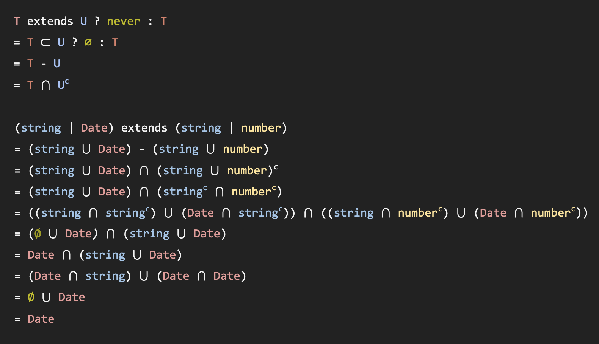

# "Exclude"?

## 1. 이슈

```ts
type Exclude<T, U> = T extends U ? never : T

type T = Exclude< string | Date, string | number >

// 곧바로 대입해보면
type T1 = (string | Date) extends (string | number) ? never : (string | Date)

// 거짓이므로
type T2 = string | Date
```
이런 결론이 나와야 하는 것이 아닌가?

## 2. 추론

T 가 유니온인 경우에 대한 처리가 관건.

```ts
type Exclude_1<T1 | T2, U> = (T1 | T2) extends U ? never : (T1 | T2)
type Exclude_2<T1 | T2, U> = (T1 extends U ? never : T1) | (T2 extends U ? never ? T2)
```

Exclude_1의 경우, 배제한다는 의미('exclude')와 맞지 않다.
Exclude_2와 같이 하나하나 처리하는 것이 맞을 것 같다.

## 3. 검증

### Exclude 집합 개념으로 풀이


### 공식문서 참고
[distributive conditional types](https://www.typescriptlang.org/docs/handbook/2/conditional-types.html#distributive-conditional-types)

> "generic type 에 union type 을 전달하면 union type 을 구성하고 있는 각각의 type 에 대하여 연산을 수행 후 다시 union 을 적용한다."

## 4. 최종풀이

```typescript
type T1 = 
  ( Exclude< string, string | number > ) |
  ( Exclude< Date, string | number > )

type T2 = 
  (string extends string | number ? never : string) |
  (Date extends string | number ? never : Date)

type T3 = never | Date

type T4 = Date
```
